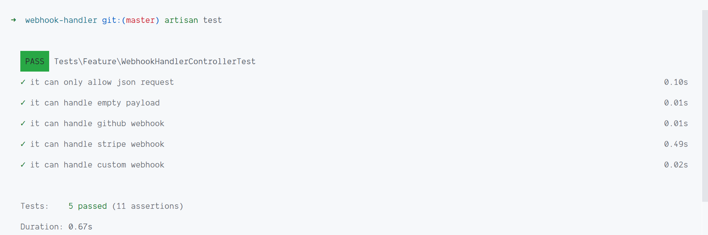
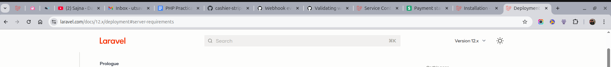
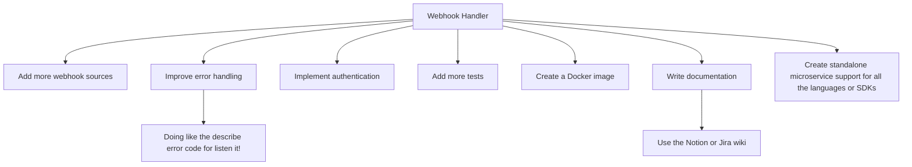

### Webhook Handler
This is a simple webhook handler designed to process incoming webhooks from various services. While it's not a traditional microservice that can be easily integrated or installed via composer require, you can still use it as a microservice by deploying it independently and configuring your services to send webhooks to its endpoint.
It's built to be easy to use and customizable, supporting multiple webhook sources.

### Features
- Easy to use
- Customizable
- Supports multiple webhook services

### Installation
- PHP >= 8.2
- [Other Laravel requirements](https://laravel.com/docs/12.x/deployment#server-requirements)

### Setup

1. Clone the repository:
    ```bash
    git clone https://github.com/utsavsomaiya/webhook-handler.git
    cd webhook-handler
    ```

2. Install dependencies:
    ```bash
    composer install
    ```

3. Copy the `.env.example` file to `.env` and configure the environment variables:
    ```bash
    cp .env.example .env
    ```

4. Generate the application key:
    ```bash
    php artisan key:generate
    ```

5. Run database migrations:
    ```bash
    php artisan migrate
    ```

6. Start the development server:
    ```bash
    php artisan serve
    ```

### Running the Microservice
1. Deploy the application to your preferred hosting environment (e.g., AWS, DigitalOcean, or a local server).
2. Configure the webhook URL in the service you want to handle webhooks from. The URL should point to your deployed application's webhook endpoint.

### Running Tests
1. Make sure you copy the `.env.example` file to `.env.testing` and configure the environment variables for testing.
    ```bash
    cp .env.example .env.testing
    ```

2. Run the test suite using PHPUnit:
    ```bash
    php artisan test
    ```


### Screenshots of the Working Environments
#### When Tests Pass, We Party 🎉
<details>
    <summary>Here are some screenshots showcasing the passing test cases and the browser tabs open during development:</summary>
    
    
</details>

### Future plans

